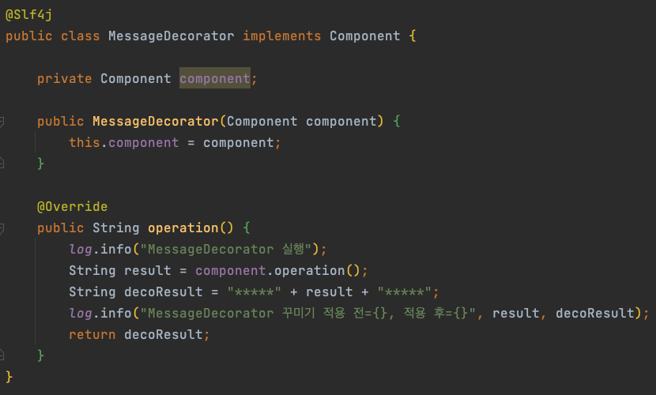

# 데코레이터 패턴

## 정의
- 어떤 대상의 부가 기능을 추가하는 패턴
- 데코레이터 패턴은 체이닝 형식으로 여러개를 연결하여 추가하는 것이 가능
- 항상 꾸며줄 대상이 존재해야 함 -> 호출 대상이 꼭 필요

## 추상클래스
- 데코레이터 패턴에 추상 클래스가 필요한지는 해당 패턴을 사용하는 의도에 따라서 선택하면 된다.

## 구조

### 인터페이스


- 기본적으로 프록시 패턴과 동일하기 때문에 인터페이스를 생성해준다.

### 구현체


- 구현체오 프록시 패턴과 마찬가지로 구현해준다.

### 메세지 데코레이터


- ```Component``` 인터페이스를 주입 받아서 기존 메세지 앞뒤로 꾸며주는 데코레이터이다.

### 타임 데코레이터


- ```Component``` 인터페이스를 주입 받아서 실행 시간을 출력해주는 데코레이터이다.

### 사용


- 위 인터페이스를 사용하는 클라이언트 예제


- 첫번째 테스트는 메세지 데코레이터를 추가하는 내용인데 구현체를 주입 받아서 메세지 데코레이터를 실제 클라이언트 쪽으로 넘겨 준다.
- 두번째 테스트는 체이닝 형식으로 데코레이터를 추가하는 내용인데 메세지 데코레이터, 타임 데코레이터를 차례로 실행한 후 마지막에는 클라이언트를 실행하는 내용이다.
    - 구현체 -> 메세지 데코레이터 -> 타임 데코레이터 -> 클라이언트