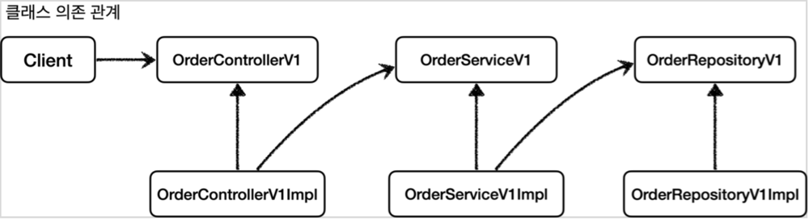
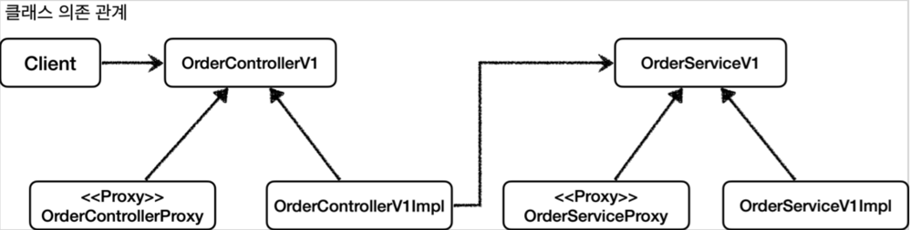
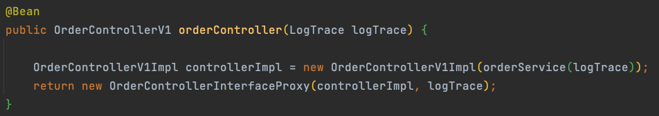
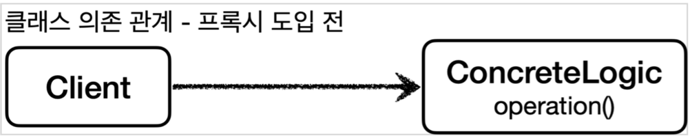
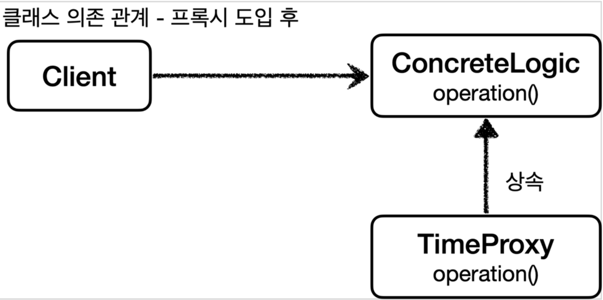
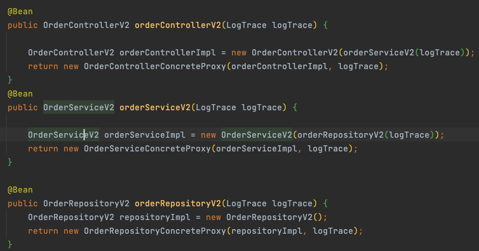

# 인터페이스 기반 프록시 패턴
인터페이스 기반의 프록시를 사용함으로서 기존 코드 수정 없이 프록시 패턴을 도입할 수 있다.

## 적용 전

- 인터페이스 프록시 패턴 적용 전에는 구현체가 인터페이스를 의존하는 형태

## 적용 후




- 인터페이스 프록시 패턴 적용 후에는 프록시와 구현체가 모두 인터페이스를 의존하는 형태
- ```bean``` 등록 시에는 실제 구현체를 포함한 프록시를 ```return``` 하는 형태

## 단점
- 인터페이스가 필요하다는 그 자체

# 구체 클래스 기반 프록시
자바의 다형성을 이용하여 기존 클래스 대신 프록시 클래스를 대신 주입시켜 준다.

## 적용 전


## 적용 후



- ```bean``` 등록 시에 구체 클래스를 주입 받는 프록시 클래스가 실제로 등록되게 된다.

## 단점
- 부모 클래스의 생성자를 호출해야함
- 클래스에 final 붙으면 상속 불가
- 메서드에 final 붙으면 오버라이딩 불가