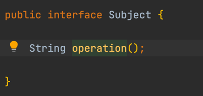
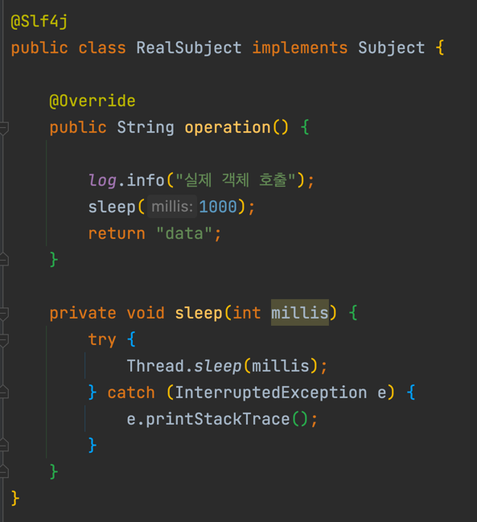
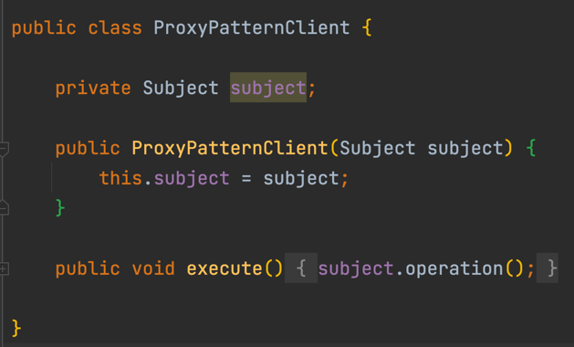
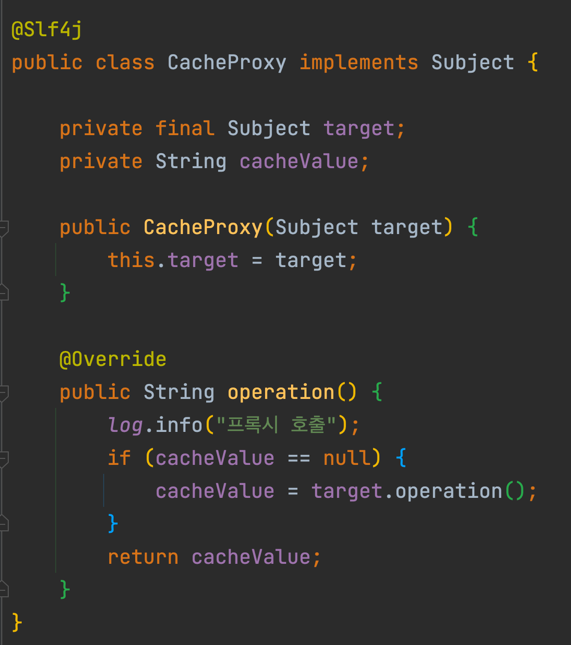
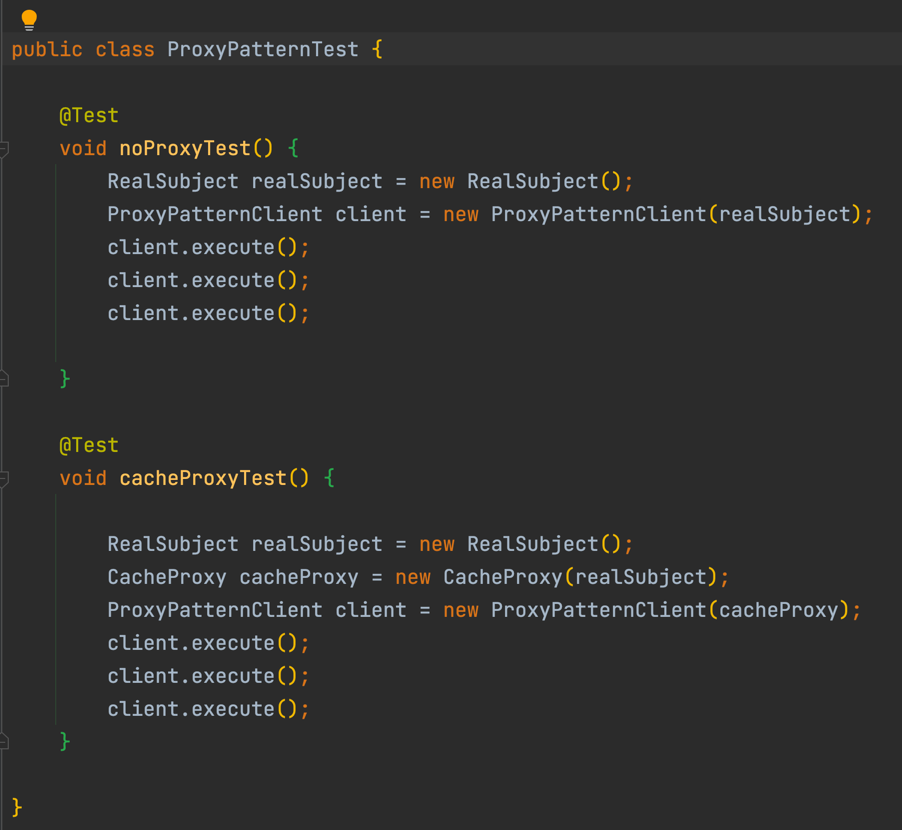
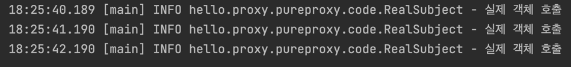
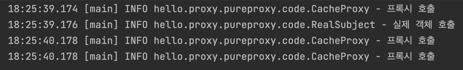

# 프록시 패턴

## 정의
- 기본적으로 어떠한 일을 대신하는 역할이 프록시 패턴의 주요 역할이다.
- 데코레이터 패턴과 흡사하지만 역할이 다르다.
- 프록시 패턴은 접근 제어, 데코레이터 패턴은 부가 기능이 주 목적이다.

## 구조
### 인터페이스


- 기본적으로 인터페이스가 사용된다.

### 구현체


- 구현체를 사용하는 것도 기존과 동일하다.

### 사용


- ```Subject``` 인터페이스를 사용하는 클래스이다.
- ```Subject``` 인터페이스를 주입 받아서 ```Subject```의 ```operation``` 메소드를 실행한다.

### 프록시 객체


- ```Subject``` 인터페이스를 주입 받아서 지역변수를 활용하여 ```Subject``` 의 ```operation``` 메소드를 지역 변수에 저장하고 지역 변수의 데이터가 존재하면 해당 변수를 리턴해준다.
- 지역 변수의 데이터가 없는 경우에만 ```Subject``` 인터페이스를 호출한다.

## 테스트


- 위쪽은 프록시 객체를 사용 안한 경우, 아래쪽은 프록시 객체를 사용한 경우다.



- 프록시 객체를 사용 안하면 매번 실제 객체를 호출한다.



- 프록시 객체를 사용 하면 프록시 클래스 안의 지역 변수가 null인 경우에만 실제 객체를 호출한다.