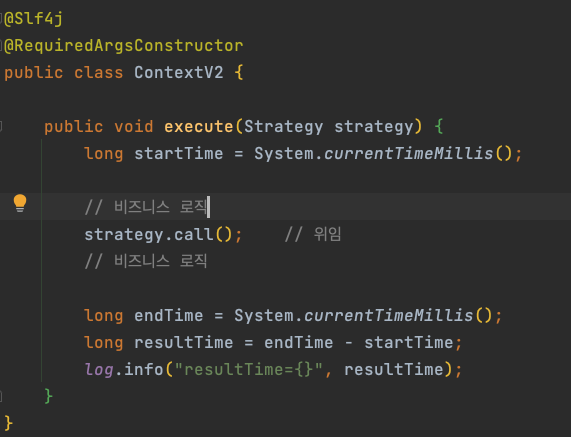

# 전략 패턴 (Strategy)
* 변하지 않는 부분을 ```context``` 라는 곳에 두고 변하는 부분을 ```Strategy```라는 인터페이스를 만들고 해당 인터페이스를 구현하도록 해서 ```템플릿 메서드 패턴```에서의 상속과 관련된 문제를 해결한 패턴
* 선 조립 후 실행

## 기본 구조
### Context
* 비즈니스 로직이 실행될 기본 틀



### Strategy
* Context 클래스에서 의존하게 될 인터페이스
* Context 클래스에서 실행할 메소드만 존재한다.


### Logic
* Strategy 인터페이스를 구현할 구현체


## 방식
1. 필드에 전략을 보관하는 방식
   

   
2. 파라미터로 전략을 전달받는 방식


### 방식 차이점
* 두 개의 방식중 자주 사용하는 방식은 2번이다. 
* 필드에 전략을 보관하게 되면 변경이 어렵다. 
* 조금 더 유연하게 사용하려면 메소드 실행 시에 전략을 파라미터로 전달 받아서 사용하는 방식이 조금 더 유연하다고 할 수 있다.