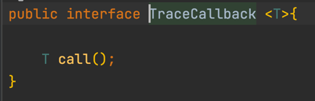
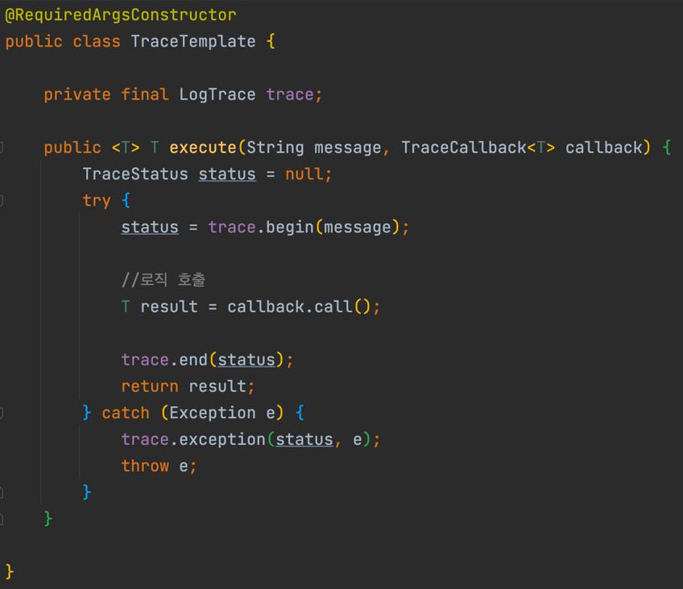
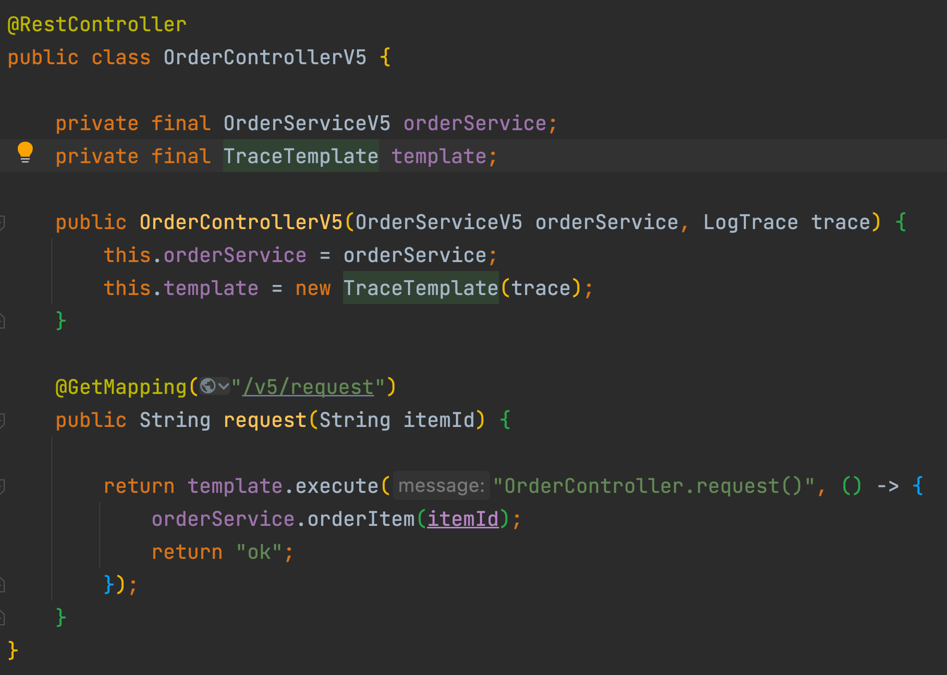

# 템플릿 콜백 패턴 (Template Callback)
- 전략 패턴에 익명 내부 클래스(혹은 람다 표현식)을 추가하여 사용하는 패턴
- 스프링에서 자주 사용하는 방식으로 전략 패턴에서 진화된 패턴

## 구조

### 전략(Strategy)



- 전략 부분은 전략 패턴과 동일
- 다만 제네릭으로 타입을 선언해주는 부분만 다르다.

### 구현



- 구현 부분에서는 전략 부분을 파라미터로 전달 받는다.
- ```로직 호출``` 부분에서 파라미터로 전달 받은 전략의 메소드를 실행하여 준다.
- 현재 클래스에서 공통으로 사용하는 기능들을 추가하고 전략마다 다른 기능들은 파라미터로 전달 받은 전략 클래스를 통하여 구현해 준다.

### 사용



- 여기서 TraceTemplate(구현) 클래스를 주입받지 않고 생성하고 있는데, 이는 테스트 시의 편리함을 위해서이다.
- 싱글톤으로 사용하는 것보다 이점이 많아서 이런 식으로 많이 사용하고 있다.
- 물론 주입받아서 사용해도 되지만 이정도의 클래스 생성은 메모리를 크게 잡아먹지 않는다고 한다.
- ```TraceTemplate``` 클래스의 ```execute``` 메소드를 실행함과 동시에 현재 클래스에서 구현할 기능을 익명 클래스 혹은 람다 표현식으로 구현하여 준다.
- 현재 코드에서는 람다 표현식으로 구현하였으며 ```Java8``` 이상은 람다 표현식을 써주는 경우가 더 많고 가독성도 좋다.

## 스프링 에서의 사용
- ```Spring```에서 ```XXXTemplate```으로 끝나는 클래스들은 모두 ```템플릿 콜백 패턴```을 사용하고 있는 것이다.
- 해당하는 클래스를 발견하면 현재 여기서 구현한 내용이 들어가 있는지 확인해보자.