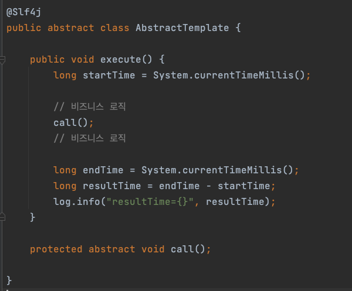
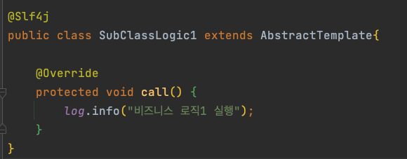

# 템플릿 메서드 패턴 (Template Method)
* 부모 클래스에 변하지 않는 패턴을 두고, 변하는 부분은 자식 클래스에 두어 상속을 통하여 문제를 해결하는 패턴

## 기본 구조
### 부모

* 부모 클래스는 추상 클래스로 만들어 준다.
* 변하지 않는 로직을 정의한 메소드가 있다.
* 변하는 부분에 대한 추상 메소드를 정의해두고 나중에 자식 클래스에서 상속하여 정의한다.

### 자식

* 변하는 부분에 대하여 부모 클래스에서 정의한 추상 메소드를 오버라이딩하여 실제로 구현해준다.

## 이슈
* 상속 관계이기 때문에 부모 클래스가 바뀌게 된다면 자식 클래스도 영향을 받게 된다.
* 부모 클래스의 로직을 사용하지 않는 경우에도 상속을 해야 한다.
* 이러한 단점을 해결하기 위해서 전략(Strategy) 패턴이 존재한다.
